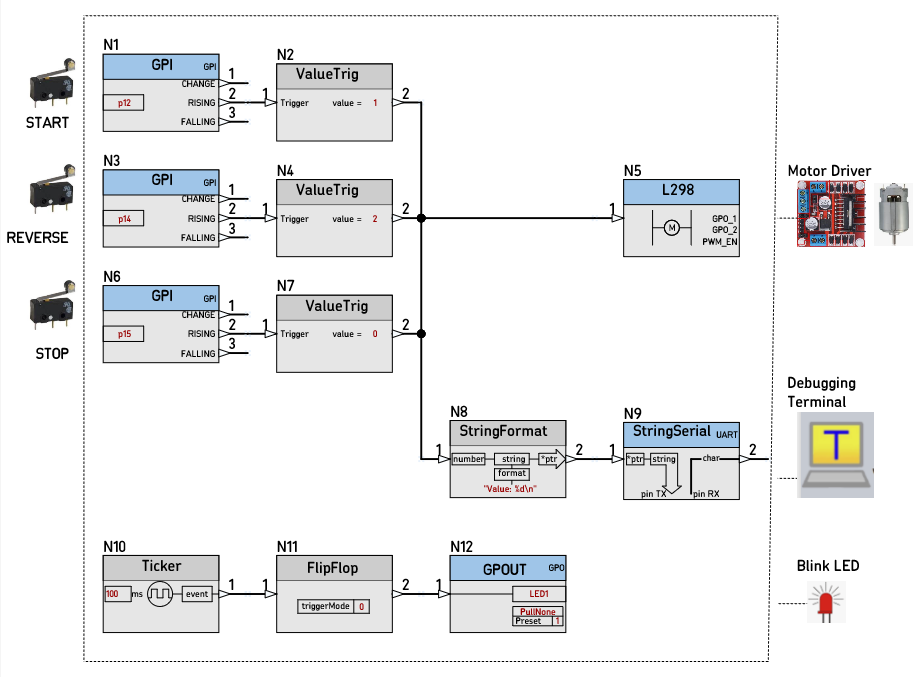

# SCHEMATIC_10D_MotorTest

Schematic Design project to test the new Nodes:  

* [Node L298](https://github.com/nBlocksStudioNodes/nblocks_l298) :heavy_check_mark:
* [Node GPITrigger](https://github.com/nBlocksStudioNodes/nblocks_gpittrigger) :x:
* [Node ConstTrigger](https://github.com/nBlocksStudioNodes/nblocks_consttrigger) :x:
* [Node ValueTrig](https://github.com/nBlocksStudioNodes/nblocks_valuetrig) :heavy_check_mark:

To be automatically translated from nBlocksStudio Translator.


The C++ project is here: [10D_MotorTest](https://github.com/nBlocksStudioApps/10D_MotorTest)  

----

<!-- pagebreak -->

Use case:
*  Button [Transition 0 to 3.3V] at Pin p12 starts the movement, direction right
*  EndSwitch [Transition 0 to 3.3V] at Pin p14 change direction
*  EndSwitch [Transition 0 to 3.3V] at Pin p15 stop

----

<!-- pagebreak -->


Schematic nBlocksStudio Design :heavy_check_mark:

<p align="center">

</p>

----

<!-- pagebreak -->

Translation Pass:heavy_check_mark:

<p align="center">

</p>

----

<!-- pagebreak -->

C++ code creation Pass:heavy_check_mark:

<p align="center">

</p>

----

<!-- pagebreak -->

Compiler Pass :heavy_check_mark:

<p align="center">

</p>

----

<!-- pagebreak -->

Flash Programming Pass:heavy_check_mark:

<p align="center">

</p>

<p align="center">

</p>

----

<!-- pagebreak -->

Serial Terminal Pass:heavy_check_mark:

<p align="center">

</p>

----

<!-- pagebreak -->

Led testing Pass:heavy_check_mark:

<p align="center">


```
  *  LED1:                                  Is the Blink LED
  *  LED2 = 1, LED3 = 0 (L298 IN2, IN2):    Movement Direction Right
  *  LED 4 =                                Low Duty Cycle 5%: Motor is turning Right
```

</p>
<p align="center">

</p>

----

<!-- pagebreak -->

Next: test with LPC1768-mbed, L298-breakout and a DC Motor :question:

----

<!-- pagebreak -->

Next: Test with Nucleo STM32F401 AND Nucleo DC motor expansion board :question:

----